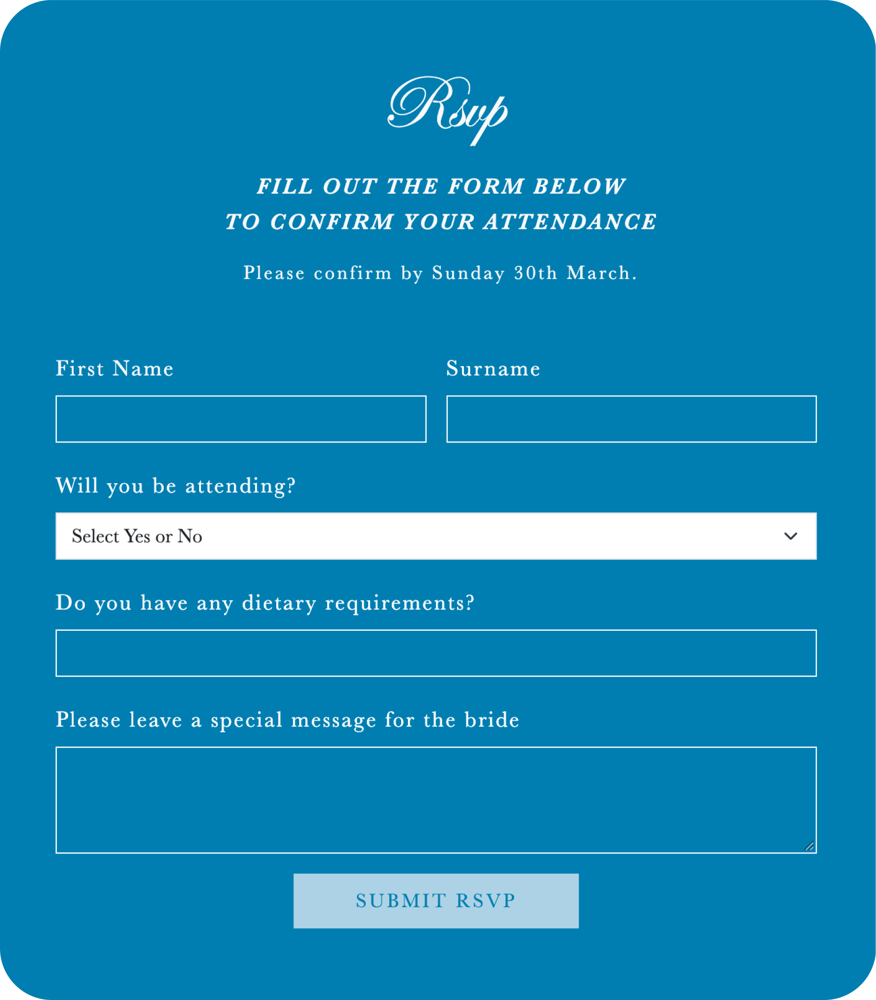
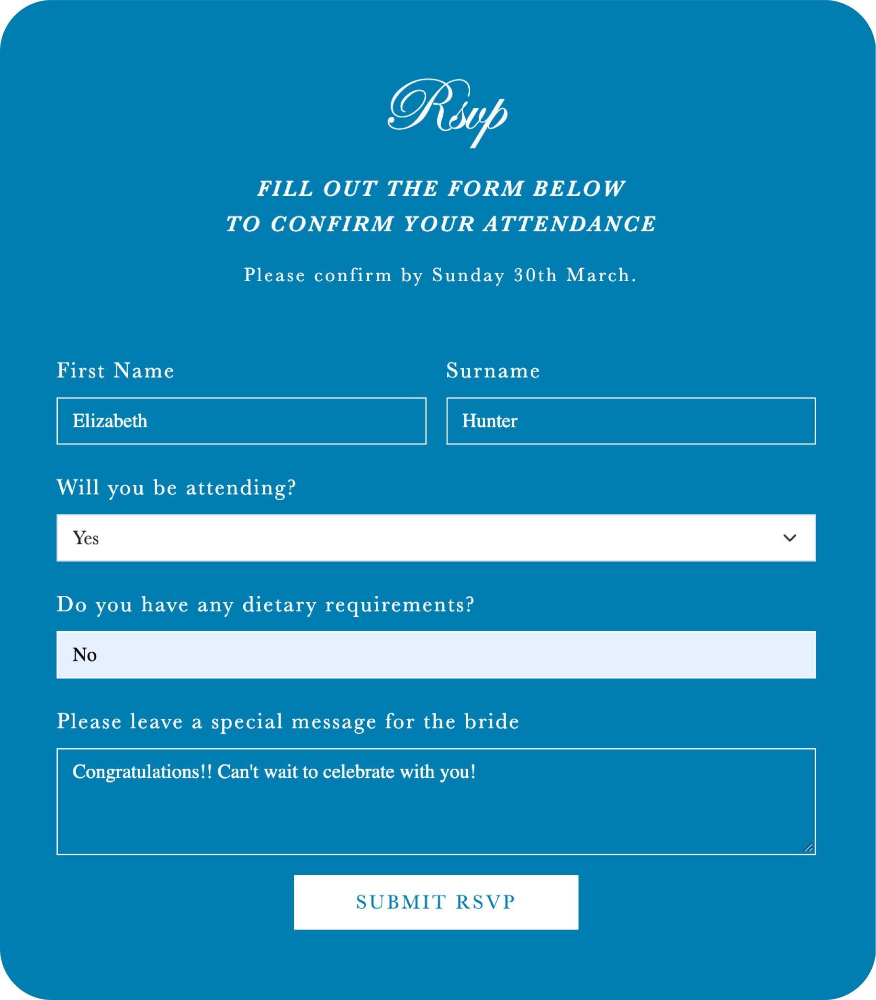
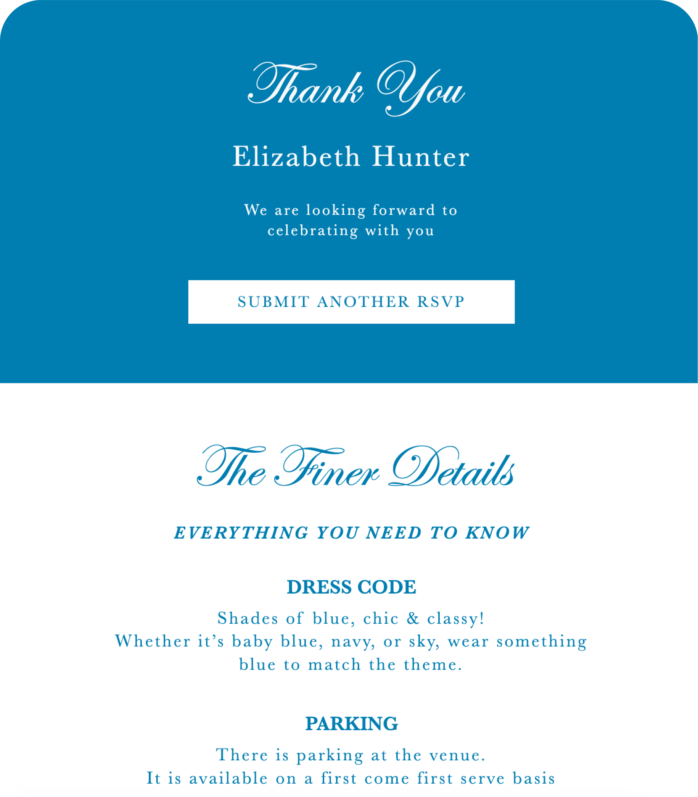
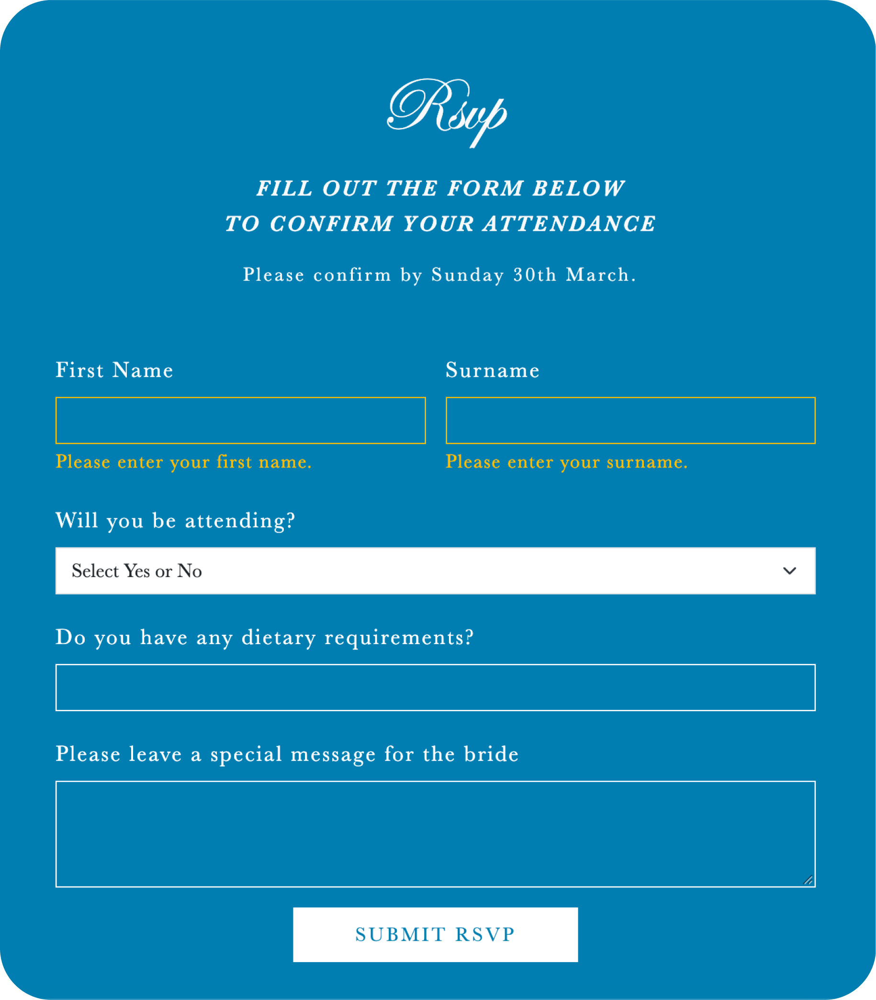
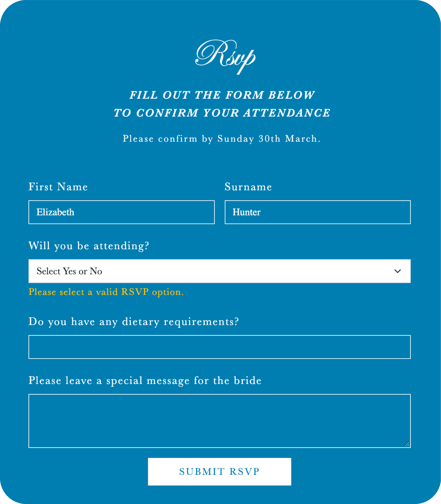
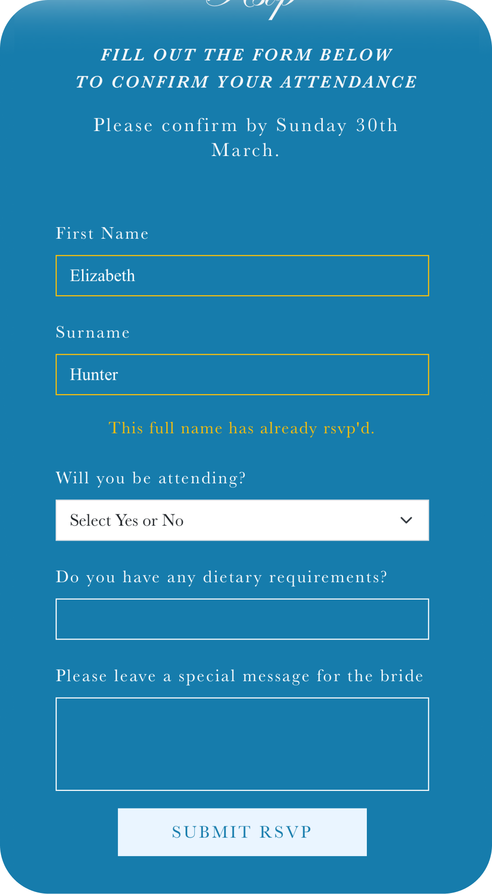

# Bridal Shower RSVP Application 💐

A responsive RSVP application built for a private bridal shower, allowing guests to confirm their attendance, provide dietary requirements and access event informtion.


> **🔐 Project Disclaimer & Privacy Notice:** This application was custom built for a private bridal shower, which has now concluded. To protect guest privacy all real guest names have been replaced with mock data.

🔗 [Live Demo](https://bs-event-rsvp.netlify.app/)

## 📋 The Problem

The event required a simplier way for guests to confirm their attendance and details without the client having to gather responses manually from a list of `60 invitees`. The client needed the guests to have the ability to submit their messages for the bride and view specific event details which they could frequently refer to.

## 📱 The Solution

I built a mobile-friendly RSVP application that allowed guests to submit their details online from their desktops and phones.

**Guest User Journey:**

`Open RSVP Form -> Fill Form Details -> Submision Confirmation`

<table>
  <tr>
    <td>RSVP Form</td>
     <td>Form Details</td>
     <td>Successful Submission</td>
  </tr>
  <tr>
    <td></td>
       <td></td>
     <td></td>
    
  </tr>
 </table>

#### Additional Information

Further down the two column page, there was additional information (location, time, deadline, faqs and giftlist) provided for the guests, so they could access important details before submitting the rsvp.


## 📋 Features

- **RSVP Submission:** `60 guests` could confirm whether they would attend the event.
- **Guest Details:** Collected information required for the event planning, including dietary requirements and special messages.
- **Event Information:** Important event details were provided for the guests.
- **Responsive Design:** Designed for mobile devices, so guests could also confirm from their phones.
- **Form Validation:** Handled empty fields with clear error messages.
- **Supabase Integration:** Stored and retrieved guest information using Supabase.

## 🚫 Validation

<table>
  <tr>
    <td>Empty Inputs (Disabled Button)</td>
    <td>Full Name Required</td>
    <td>RSVP Required</td>
  </tr>
  <tr>
    <td></td>
   <td></td>
    <td></td>
  </tr>
 </table>

 <table>
  <tr>
    <td>Full Name Duplication (Mobile View)</td>
  </tr>
  <tr>
     <td></td>
  </tr>
 </table>

## 🪑 Tech Stack

- **Frontend:**    
- **Backend/Database:**  
- **Deployment:** 

## 📚 Improvements

If the application was developed futher, I would improve these features.

- **Admin Interface:** Allow event organisers to view guest responses and update event information without editing the database directly.
- **Confirmation Emails:** Send automated confirmation emails after submission.

## 🛠️ Get Started

### Clone the repository

```
git clone https://github.com/Vicko657/event-rsvp-app.git
cd event-rsvp-app
```

### Configure environment variables

- Create a `.env` file in the project root, see `.env.example` for required variables.

### Build and run:

```
npm install
npm dev run
```

## 🌍 Deployment

This project is deployed on [Netlify](https://bs-event-rsvp.netlify.app/).
